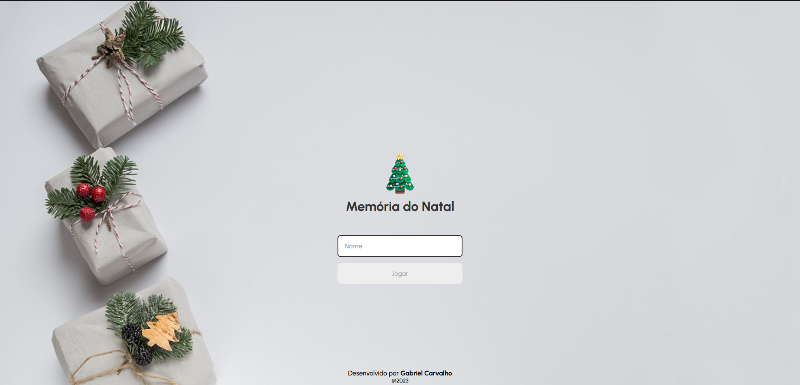
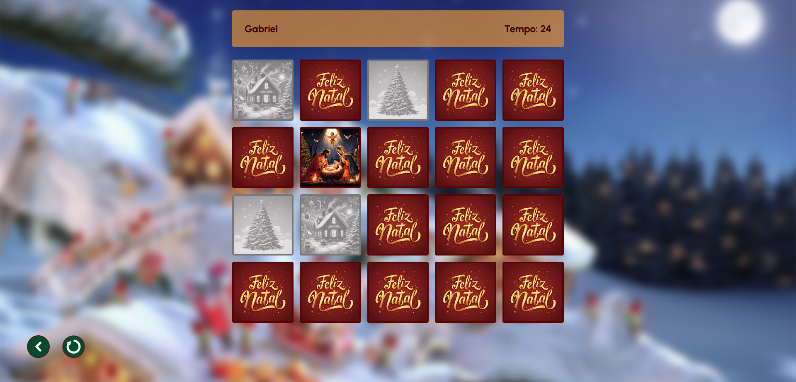
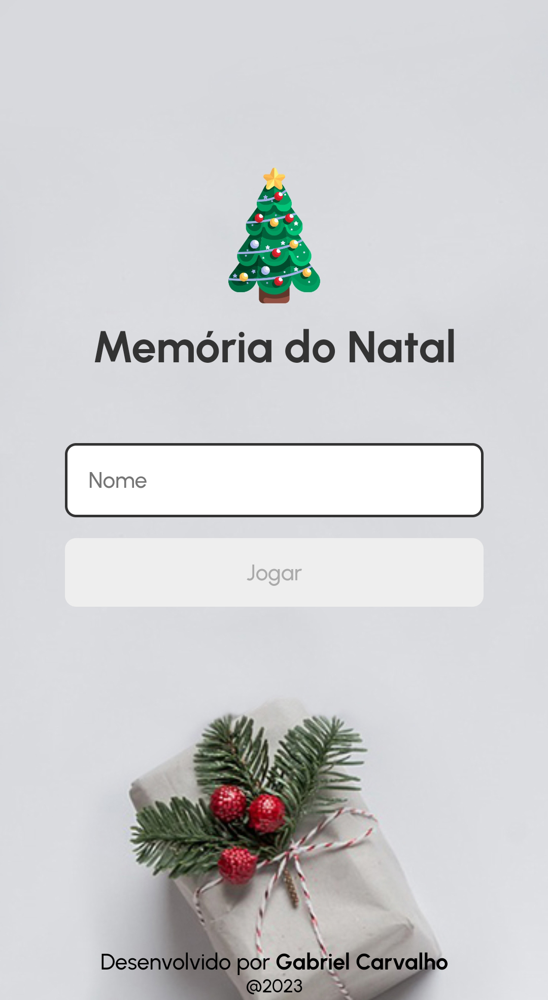
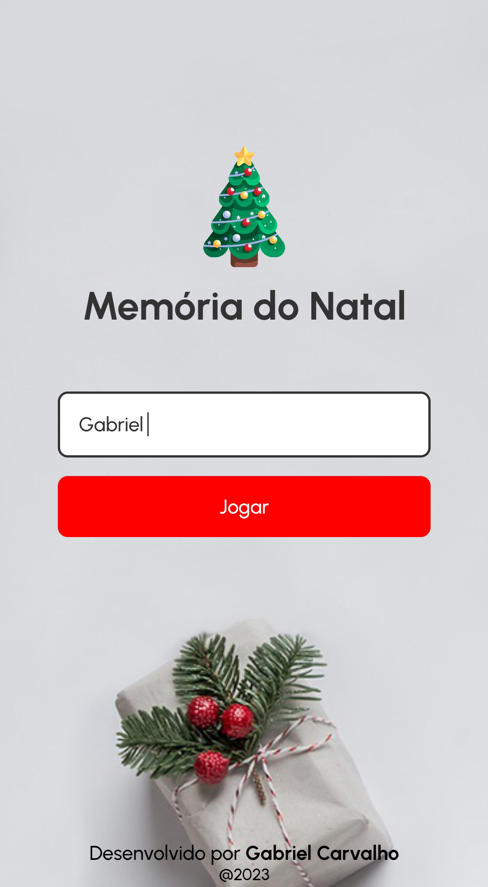
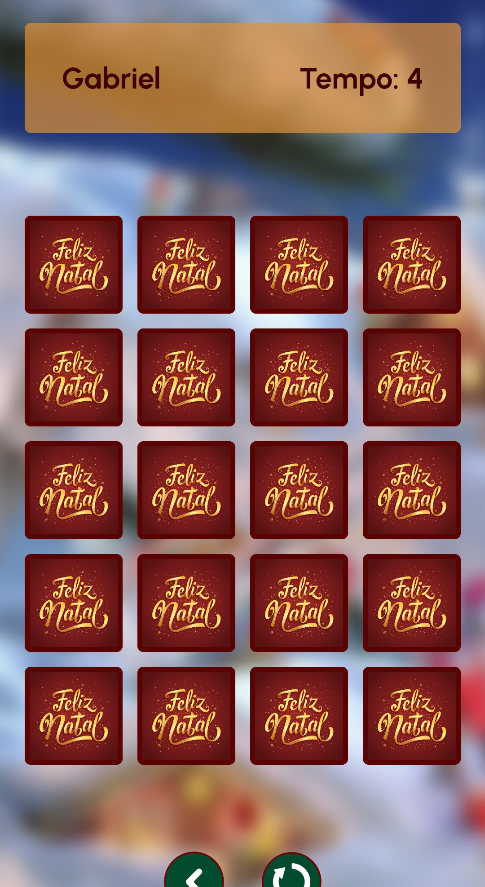
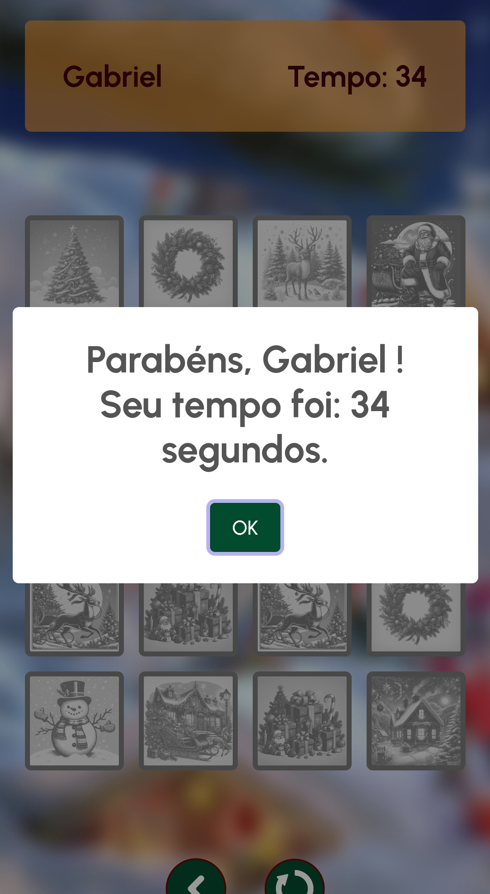

# Memória do Natal 🎄

Este projeto é um jogo da memória interativo que foi desenvolvido tendo como base uma série de vídeos no Youtube do canal "Manual do Dev" onde fiz mudanças condizentes com meu objetivo.
## Stack utilizada

  

## Melhorias feitas 💡
- Responsividade
- Botão de retorno e botão reload na página do jogo
- Efeitos sonoros
- Alert no placar final do jogo

## Screenshots 🖵 
**Tela de login**

**Tela do jogo**

## Responsividade 📱

**Smartphone**

       

## Disponível em: 
https://memoria-do-natal.netlify.app/
